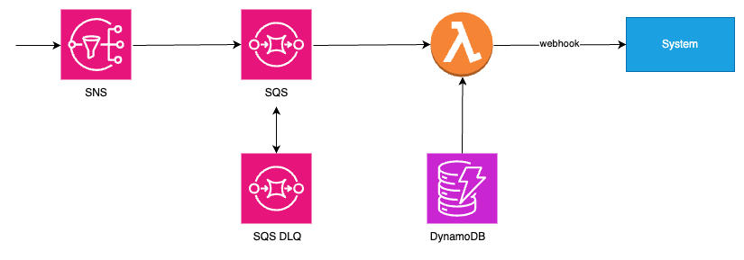

[](https://github.com/nkcoder/whitehaven/actions/workflows/validate_pr.yml) [](https://github.com/nkcoder/whitehaven/actions/workflows/validate_pr.yml) [](https://github.com/nkcoder/whitehaven/actions/workflows/deploy_pipeline.yml)

This project includes a AWS Lambda function, which consumes messages from AWS SQS, gets data from AWS DynamoDB, then notifies remote systems by calling webhook APIs.

The project is deployed to AWS using the [Serverless Framework](https://www.serverless.com/), and pipelined using Github Actions.

## System Diagram



## Tech Stack

- TypeScript/Node.js
- AWS services
  - AWS Lambda function
  - AWS SQS
  - AWS DynamoDB
- [Serverless Framework](https://www.serverless.com/): for IaC and deployment
- Github Actions: for CI/CD
- [purify-ts](https://gigobyte.github.io/purify/): a small functional programming library for TypeScript
- [vitest](https://vitest.dev/): unit testing with test coverage
- [zod](https://zod.dev/): schema validation
- [ky](https://github.com/sindresorhus/ky): delightful HTTP requests
- [ESLint](https://eslint.org/): code linting with TypeScript support
- [Prettier](https://prettier.io/): code formatting

## Development

Install the latest LTS Node.js, then install dependencies:

```sh
nvm install --lts
nvm use .

npm install
```

Run the linter:

```sh
auto/lint
```

Run the formatter:

```sh
auto/format
```

Run the tests:

```sh
auto/test
```

Run locally/offline:

```sh
auto/run_local
```

## 1Pager

[1Pager](./docs/1pager.md)
